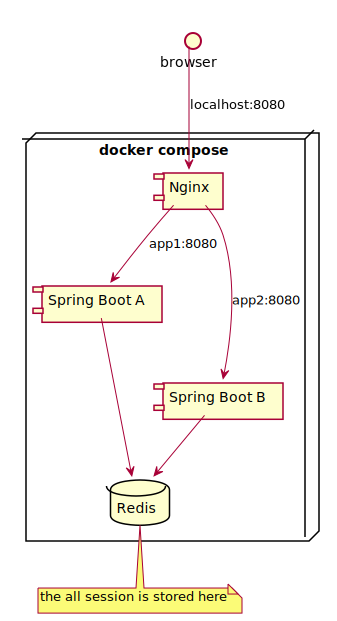

# spring-session-sandbox
This project works on docker-compose.

The session issue is not occurred on this branch's code (for more details, please see the README.md of master branch).
Because the all session is stored in Redis.



## Getting Started
```
$ ./mvnw clean install && docker-compose up --build
```

Now the server is running, visit http://localhost:8080/session-attr with your borwser.

## Endponts
- The session sample implemented by @SessionAttributes
  - http://localhost:8080/session-attr
  - the login user infoformation
    - id: userA
    - password: password
- The PRG pattern sample by frash scope (this scope uses temporary session)
  - http://localhost:8080/flash-scope
